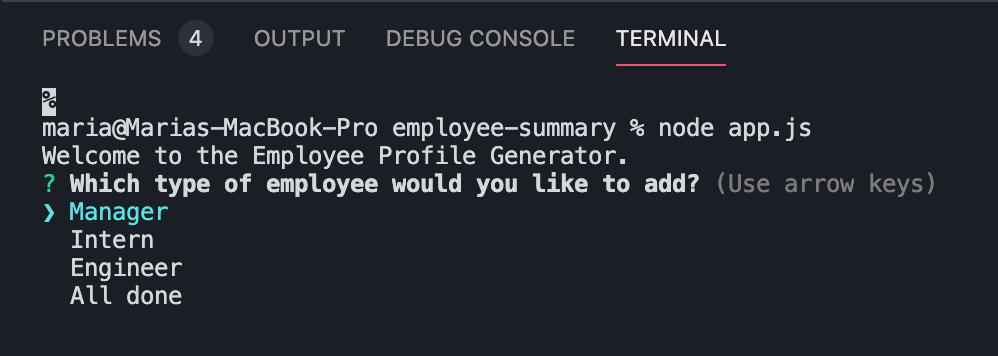
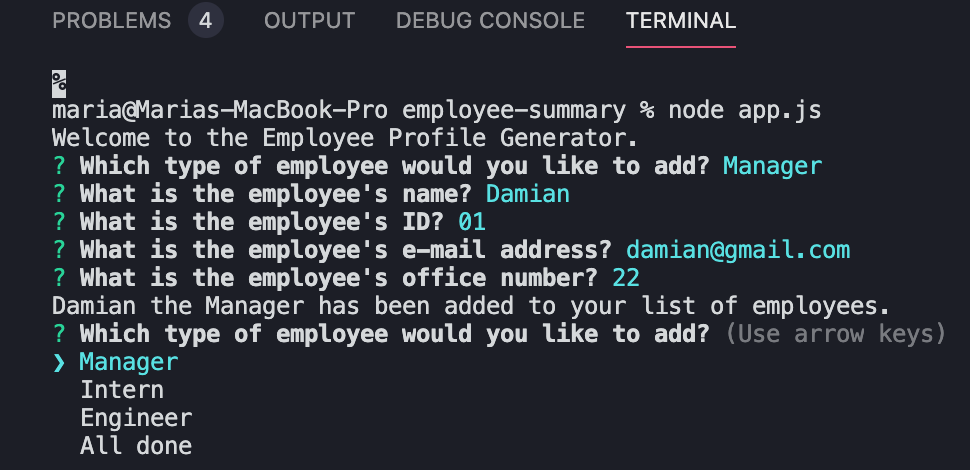
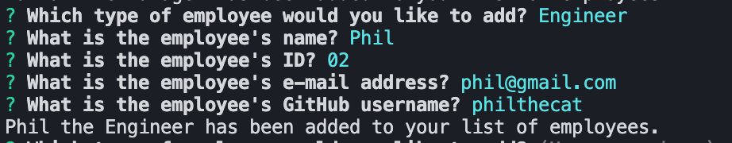
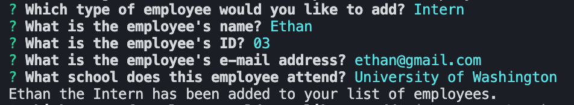
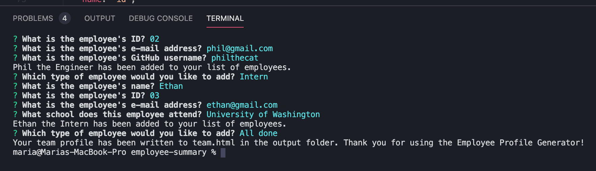
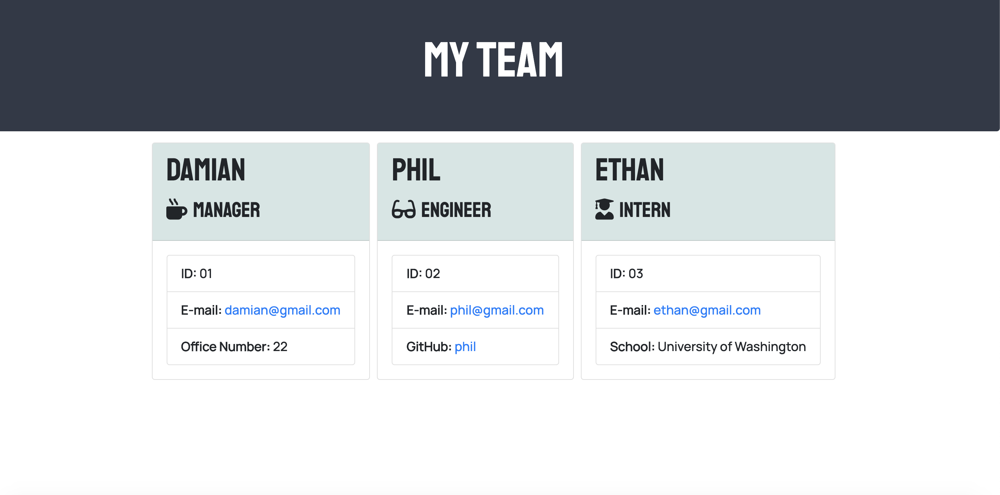

# Employee Profile Generator

> As an employer who wishes to display information about their employee team, one might wish to construct a webpage showing this information in a timely manner. This application utilizes Node.js and inquirer.js to prompt its users for a list of employees, and then writes the information they provide to a fully formatted HTML file of team members' profiles.

 ## Table of Contents
  * [Description](#description)
  * [Installation](#installation)
  * [Usage](#usage)
  * [Screenshots](#screenshots)
  * [License](#license)
  * [Questions](#questions)

## Description

When displaying information about one's company, an employer may wish to efficiently create a website showing their employees' basic information, such as their names, IDs, email addresses, and additional information about their respective positions. Using Node.js and the node package inquirer.js, the Employee Profile Generator application allows users to create a fully formatted HTML page using Bootstrap CSS with their employees' information. Users are able to add as many employees as they want to the application, and can choose from one of three categories of employee: Manager, Engineer, or Intern.

## Usage

Users can run the application by typing in "node app.js". They will then be greeted with a welcome message, and asked which type of employee they would like to add: a manager, an engineer, or an intern. There is also an option to indicate they are done adding employees: however, if the user has not yet added any employees, the program will not generate a HTML file.

Once the user has selected which type of employee they'd like to add, they are asked a series of questions. These questions ask for the employee's name, ID number, e-mail address, and another question dependent on which type of employee the user is adding. The application asks for the employee's office number if they are a manager, their GitHub username if they are an engineer, and the name of their school if they are an intern. Once all of the questions have been answered, the application shows the user that employee has been successfully added to the list, and they are asked which employee they would like to add next.

When the user is finished adding employees to the list, they can select the "All done" option to generate their employee profile. The application will then write the data the user has entered into a HTML file named "team.html", which can be found in the "output" folder of the application. This file will be fully formatted, and will display all of the information entered by the user.

You can view a tutorial video on how to use the application [here](https://drive.google.com/file/d/1U0DLK9Iz860m0H1Ga2tqvDdYkE-W0E4Y/view?usp=sharing)!

## Screenshots

Opening prompt of the Employee Profile Generator

Questions for adding a new Manager

Questions for adding a new Engineer

Questions for adding a new Intern

Message after the user has indicated they are finished and the HTML file has been successfully written

An example of a generated profile

## License

MIT License

Copyright (c) 2020 Maria Waslick

Permission is hereby granted, free of charge, to any person obtaining a copy of this software and associated documentation files (the "Software"), to deal in the Software without restriction, including without limitation the rights to use, copy, modify, merge, publish, distribute, sublicense, and/or sell copies of the Software, and to permit persons to whom the Software is furnished to do so, subject to the following conditions:

The above copyright notice and this permission notice shall be included in all copies or substantial portions of the Software.

THE SOFTWARE IS PROVIDED "AS IS", WITHOUT WARRANTY OF ANY KIND, EXPRESS OR IMPLIED, INCLUDING BUT NOT LIMITED TO THE WARRANTIES OF MERCHANTABILITY, FITNESS FOR A PARTICULAR PURPOSE AND NONINFRINGEMENT. IN NO EVENT SHALL THE AUTHORS OR COPYRIGHT HOLDERS BE LIABLE FOR ANY CLAIM, DAMAGES OR OTHER LIABILITY, WHETHER IN AN ACTION OF CONTRACT, TORT OR OTHERWISE, ARISING FROM, OUT OF OR IN CONNECTION WITH THE SOFTWARE OR THE USE OR OTHER DEALINGS IN THE SOFTWARE.

## Questions

If you have additional questions, you can contact me through my GitHub profile at [mwaslick](https://github.com/mwaslick), or e-mail me at mariawaslick@gmail.com.
